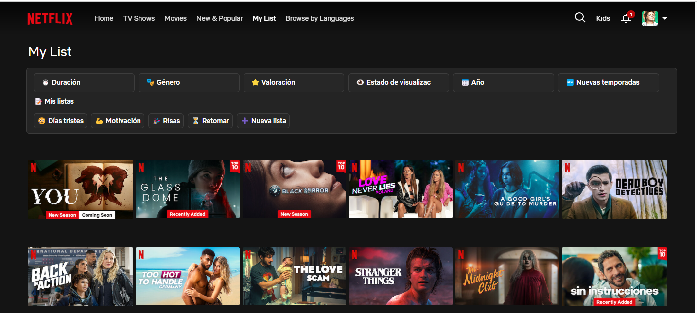
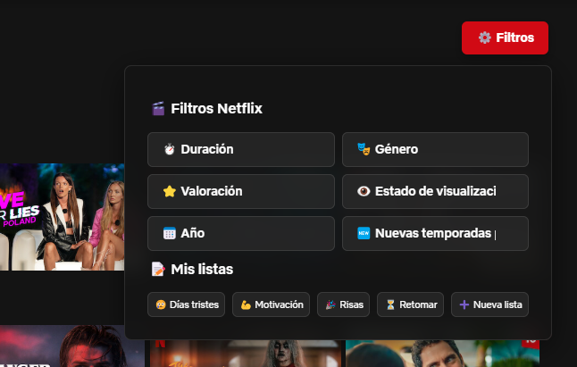
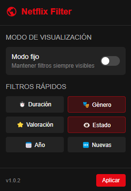

# 🎬 Netflix Filter Extension

Una extensión de Chrome que simula funcionalidades de filtrado en la sección **Mi Lista** de Netflix. Esta extensión ofrece una experiencia visual que imita un sistema avanzado de filtrado y organización de contenido.

---

## 🚀 Características principales

✅ **Diseño moderno y responsivo** para filtros personalizados  
⚙️ Modo fijo o modal (desplegable)  
📂 Agrupación por listas personales
🎭 Filtros mockeados por duración, género, valoración, estado de visualización, año, nuevas temporadas...

---

## 🖼️ Vista previa

### 🌐 Filtros en modo fijo

---

### 📦 Filtros en modal

---

### 🧩 Panel de opciones (Popup de extensión)

---

## ⚙️ Modo de visualización

Puedes elegir entre:

- `🖼️ Modal`: aparece flotando al pulsar el botón "Filtros".
- `📌 Fijo`: siempre visible en la parte superior de "Mi Lista".

---

## 🧪 Funcionalidades Mockeadas

- El contenido no es modificado dinámicamente por filtros.
- Los filtros cambian el aspecto y ocultan algunos elementos para simular una búsqueda.

---

## 🛠️ Instalación

1. Clona el repositorio.
2. Abre Chrome y entra en `chrome://extensions/`.
3. Activa el **modo desarrollador**.
4. Haz clic en `Cargar descomprimida` y selecciona la carpeta del proyecto.

---

## 📌 Nota final

Este proyecto se ha desarrollado como práctica de diseño UI y arquitectura frontend de extensiones. Está completamente desconectado del backend de Netflix.

---

## 🧠 Autor

Hecho por emepuchades .
Netflix, si estás leyendo esto: **estoy lista para llevar esto a producción cuando tú quieras**. 😎

---

## 📄 Licencia

MIT
